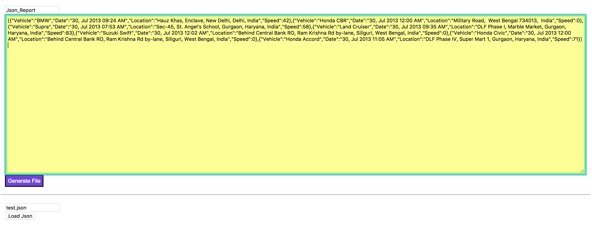

# JSON convert csv file #

### 1. Please use Chrome ###
---

### 2. Load Json ###
---

If you want to load json file, please try to setting your browser.
> Windows: 
>> `"C:\PathTo\Chrome.exe" --allow-file-access-from-files`. 
>> You can refer [This link](https://chrisbitting.com/2014/03/04/allow-local-file-access-in-chrome-windows/).

> Mac OSX:
>> in Terminal, type `open -a "Google Chrome" --args --allow-file-access-from-files`

